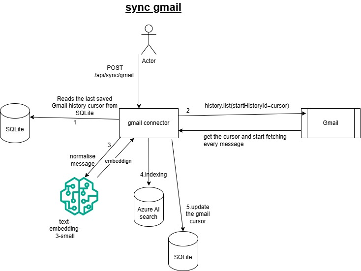
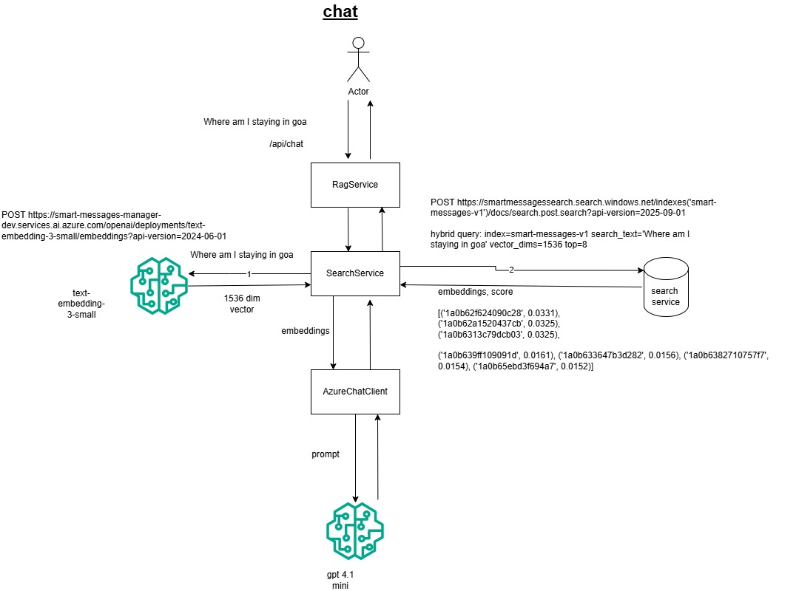

# Smart Messages Manager architecture (V1)

## Scope

V1 is a modular monolith for Gmail ingestion, hybrid message search, and evidence-grounded Q&A. The completed path is Gmail OAuth and synchronization, embedding directly into Azure AI Search indexing/retrieval, Azure OpenAI RAG with structured citations, and a minimal React/TypeScript UI covering all of the above.

## Logical flow

```text
Gmail connector -> canonical Message -> indexer (embed + upload) -> Azure AI Search
                                                                        |
UI -> FastAPI API -> RAG service -> retrieval port -> cited, evidence-only answer
```

The RAG service receives canonical messages from the retrieval port; it never calls Gmail directly. The LLM receives only selected retrieved context, never the whole mailbox. Message content is never persisted locally — Gmail sync embeds and uploads each newly synced message straight to Azure AI Search, which is the sole durable store of message content. SQLite is used only for small sync bookkeeping: the Gmail history cursor (`sync_state`) and the last-indexed content hash per message (`search_index_state`, so unchanged content is not re-embedded).

### Gmail sync flow



### Chat (RAG) flow



## Boundaries

| Boundary | Responsibility | V1 implementation status |
| --- | --- | --- |
| Connectors | Authenticate, normalize, and synchronize external sources | Gmail read-only implementation; other sources deferred |
| Models | Source-independent messages and conversations | Implemented |
| Repositories | Sync-cursor and search-index-state bookkeeping (no message content) | SQLite adapters implemented; Cosmos DB deferred |
| Search | Hybrid keyword/vector retrieval and future reranking | Implemented (Azure AI Search) |
| RAG | Evidence selection, prompt construction, citations | Implemented (Azure OpenAI structured outputs) |
| API | Health, Google OAuth, Gmail sync (embeds+indexes), and chat routes | Implemented |
| UI | User-facing search and chat experience | Implemented (minimal React/TypeScript SPA) |
| Agent tools | Future confirmed actions such as drafts/reminders | Explicitly deferred |

## Identity and idempotency

Messages are addressed by `(source, id)`. The Gmail adapter maps Gmail message IDs into this field, saves the provider history cursor only after successful processing, and re-embeds/uploads a message only if its content hash has changed since the last index. This prevents duplicate work during retries and enables incremental synchronization.

## Storage and search evolution

Message content lives only in Azure AI Search; there is no local message/conversation repository. SQLite retains two small state tables behind repository protocols (sync cursor, search-index content hash), allowing a Cosmos DB adapter later if that bookkeeping needs to move off a single machine. Azure AI Search receives a projection of each canonical message: text, subject, sender, recipients, timestamp, conversation ID, source, participants, searchable metadata, and an embedding derived from `subject + sender + text`. A search protocol conceals Azure SDK types and leaves room for semantic reranking.

## Current deployment and data state

The application runs locally. Gmail OAuth is configured only for a synthetic test mailbox with the `gmail.readonly` scope. Local OAuth refresh tokens are stored in a Git-ignored token file. `POST /api/sync/gmail` fetches new/changed mail from Gmail, embeds each message (`subject + sender + text`), and uploads a projection of it (no attachment content) plus its embedding directly to Azure AI Search — nothing is stored locally beyond the Gmail history cursor and a content hash used to skip re-embedding unchanged messages. `POST /api/chat` sends only the retrieved-context text for the top search hits (not the whole mailbox) to the Azure OpenAI chat deployment; no other message data is sent to Azure.

Azure development resources:

| Resource | Region | Purpose | Application status |
| --- | --- | --- | --- |
| Azure AI Search (Free tier) | India South Central | Hybrid message index | Implemented: index created/updated at startup, documents embedded and uploaded automatically during `/api/sync/gmail`, hybrid retrieval via `/api/search` |
| Microsoft Foundry project/resource | South India | Embedding and chat generation | Implemented: used by the indexer, search service, and RAG service |
| Embedding deployment (`text-embedding-3-small`) | South India | Convert selected message text into vectors | Implemented |
| Chat deployment (`gpt-4.1-mini`) | South India | Generate structured, cited answers from retrieved context | Implemented |

Endpoints, keys, test-account details, refresh tokens, and mailbox contents are intentionally not documented in source control.

## Frontend

`frontend/` is a Vite + React + TypeScript single-page app served independently from the backend (dev server on port 5173). It calls the FastAPI backend directly over HTTP (`VITE_API_BASE_URL`, defaulting to `http://127.0.0.1:8000`); the backend allows this origin via `CORSMiddleware`, configured through the `FRONTEND_ORIGIN` setting. The UI has three parts: a Gmail connection/sync status bar (`/api/sync/status`, `/api/auth/google/start`, `/api/sync/gmail`, which embeds and indexes new mail in one call), a search panel (`/api/search`), and a chat panel (`/api/chat`) that renders the evidence badge and citations. Playwright end-to-end tests in `frontend/e2e` drive this UI against the real backend and real Azure resources, starting both dev servers automatically.

## Implemented HTTP endpoints

| Endpoint | Purpose | Status |
| --- | --- | --- |
| `GET /health` | Local process health check | Implemented |
| `GET /api/auth/google/start` | Start test-account OAuth authorization | Implemented |
| `GET /api/auth/google/callback` | Complete OAuth callback | Implemented |
| `POST /api/sync/gmail` | Initial or incremental Gmail sync; embeds and uploads new/changed messages to Azure AI Search | Implemented |
| `GET /api/sync/status` | Connection and sync-cursor status | Implemented |
| `POST /api/search` | Hybrid retrieval | Implemented |
| `POST /api/chat` | Evidence-grounded Q&A | Implemented |

## Security and privacy

Credentials come from `.env` locally and Key Vault in production; `.env` is ignored by Git. Production design requires Entra authentication, TLS, encryption at rest, least-privilege service identities, audit logs, source-level access checks, retention policies, and deletion workflows. Attachments are future Blob Storage objects, not inline mailbox payloads. No data is sent to an LLM except retrieved context required for the question.

## Future evolution

New connectors (WhatsApp, SMS, Outlook, calendar, files, and contacts) normalize into the same models. Microsoft Foundry Agent Service may later orchestrate search, memory, and confirmed action tools. Mutating actions must always require explicit user confirmation.
